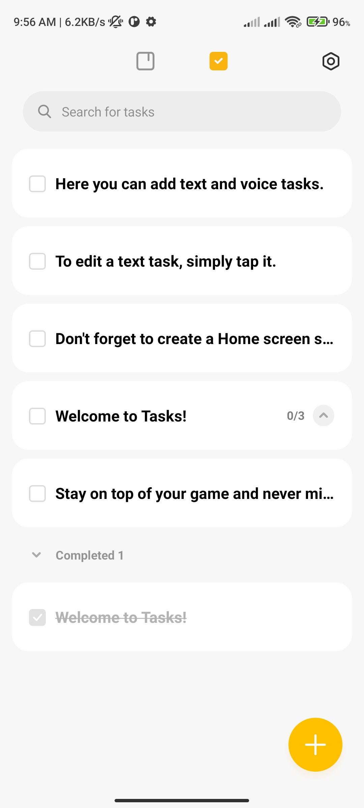
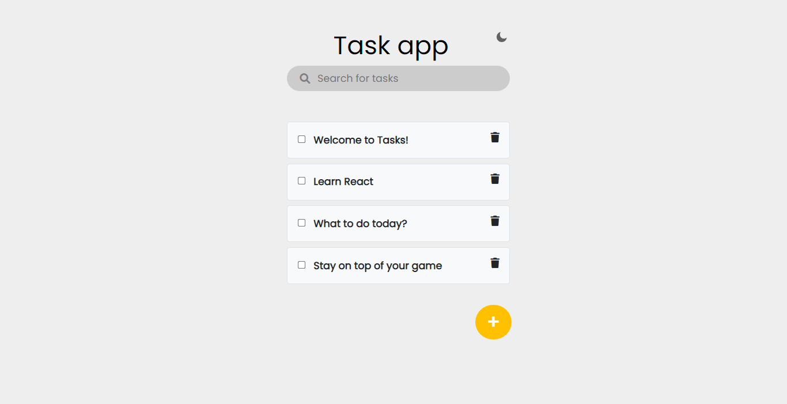

>> ## Task App


#### Link to the live website:
>[Taskapp](https://devtaskapp.netlify.app/ "taskapp live site")
___

#### Description 
>Task App is a web app made with Js for adding todos, it can search throught the list, can add new task and show completed task
____

#### Tech Used:
 >Html, CSS, JavaScript, git, github, Netlify.
___

> #### Things i have learnt : how to filter through an Array to get certain keyword
```JavaScript
// Searching the task list
let filteredTask = (term) => {

    Array.from(taskList.children)
        .filter( task => !task.textContent.toLowerCase().includes(term))
            .forEach( task => task.classList.add('filtered'));

    Array.from(taskList.children)
        .filter( task => task.textContent.toLowerCase().includes(term))
            .forEach( task => task.classList.remove('filtered'));

};

search.addEventListener('keyup', e => {
    let term = search.value.trim().toLowerCase();
    filteredTask(term);
});
```
---


>#### Design image : The desgn was gotten from a screenshot of my phone to-do app


> #### Desktop View



> #### Credits: 
NetNinja
Scythe